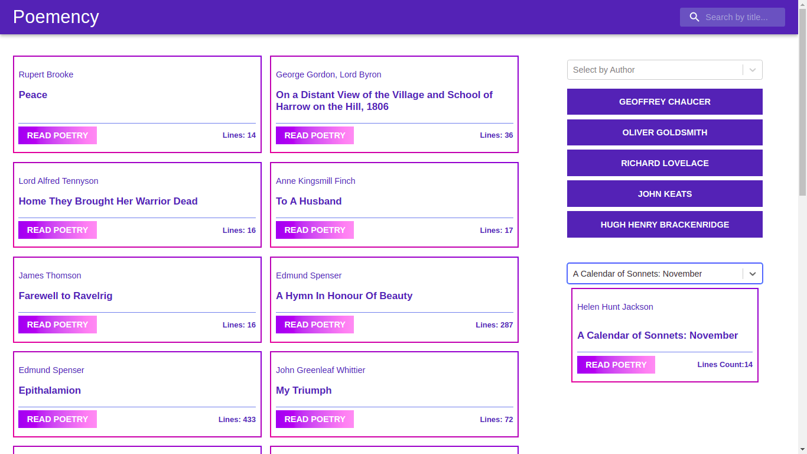
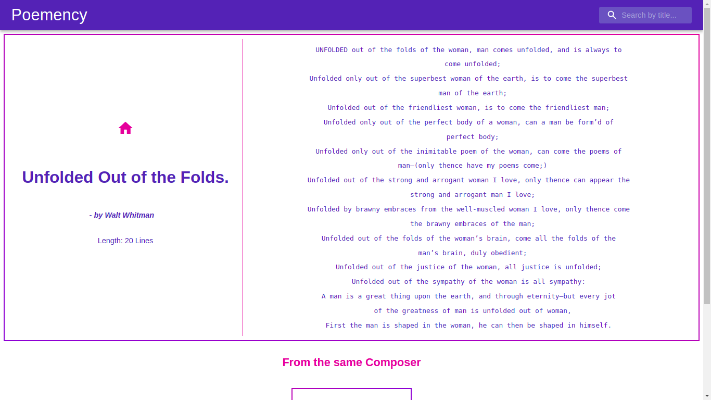

# Calculator


Poemency is a web app with a collection of almost three thousand poetries.

At Poemency a user can:
- View some randomly selected poetries from the collection of thousands of poetries on the Home page which gets refreshed on every action to serve more poetries to the user
- Can search their favorite poem by entering some keywords from the title.
- Can see five randomly selected authors and click on their names to filter poetries composed by them
- Can also look for all the poets in the select field and can choose the name of a poet to filter poetries by author name on the home page
- Can select an absolute title to view that poetry
- Can click on the READ POETRY button to go to the details page and read the complete poetry
- Can also see the suggestions for the other poetry composed by the same author on the details page






## Live Demo

[View Live]()

## Built With 🛠

```
- HTML
- CSS
- React
- Redux / Redux Toolkit
- Material UI
```

## Getting Started

> To get a local copy up and running follow these simple example steps.

### Prerequisites

- Good to have a text editor installed on your machine. You can use any default text editor that comes with the system
  like Notepad but advanced text editors like Visual Studio Code, Atom or Sublime is recommended. It will help you to
  interact with the source code.

### Setup

Refer the following documentations to download the Text Editor of your choice:

[VS Code](https://code.visualstudio.com/)

[Atom](https://atom.io/)

[Sublime Text](https://www.sublimetext.com/)

### Usage
- Clone this Repository using following command

<pre><code>git clone https://github.com/KumarAmitt/poemency.git</code></pre>

- Navigate to the directory `poemency` in your File Explorer.

- Run `npm install` to install dependencies.

- Run `npm start` to run the app in browser. Recommended: Chrome/Firefox

- If you wish to play around the codes, navigate to this Repository in the Text Editor of your choice.

## Testing

- Run `npm test` from terminal to run the tests.

## Author

### 👨‍💻 Amit Kumar

- GitHub: [@KumarAmitt](https://github.com/KumarAmitt)
- Twitter: [@ArrshAmit](https://twitter.com/ArrshAmitt)
- LinkedIn: [@kumar-amitt](https://www.linkedin.com/in/kumar-amitt)

### 🤝 Contributing

Contributions, issues, and feature requests are welcome!

Feel free to check the [issues page](https://github.com/KumarAmitt/poemency/issues).

### Show your support

Give a ⭐️ if you like this project!

### License

&copy; 2021 Amit Kumar

Permission is hereby granted, free of charge, to any person obtaining a copy
of this software and associated documentation files (the "Software"), to deal
in the Software without restriction, including without limitation the rights
to use, copy, modify, merge, publish, distribute, sublicense, and/or sell
copies of the Software, and to permit persons to whom the Software is
furnished to do so, subject to the following conditions:

The above copyright notice and this permission notice shall be included in all
copies or substantial portions of the Software.

THE SOFTWARE IS PROVIDED "AS IS", WITHOUT WARRANTY OF ANY KIND, EXPRESS OR
IMPLIED, INCLUDING BUT NOT LIMITED TO THE WARRANTIES OF MERCHANTABILITY,
FITNESS FOR A PARTICULAR PURPOSE AND NON INFRINGEMENT. IN NO EVENT SHALL THE
AUTHORS OR COPYRIGHT HOLDERS BE LIABLE FOR ANY CLAIM, DAMAGES OR OTHER
LIABILITY, WHETHER IN AN ACTION OF CONTRACT, TORT OR OTHERWISE, ARISING FROM,
OUT OF OR IN CONNECTION WITH THE SOFTWARE.